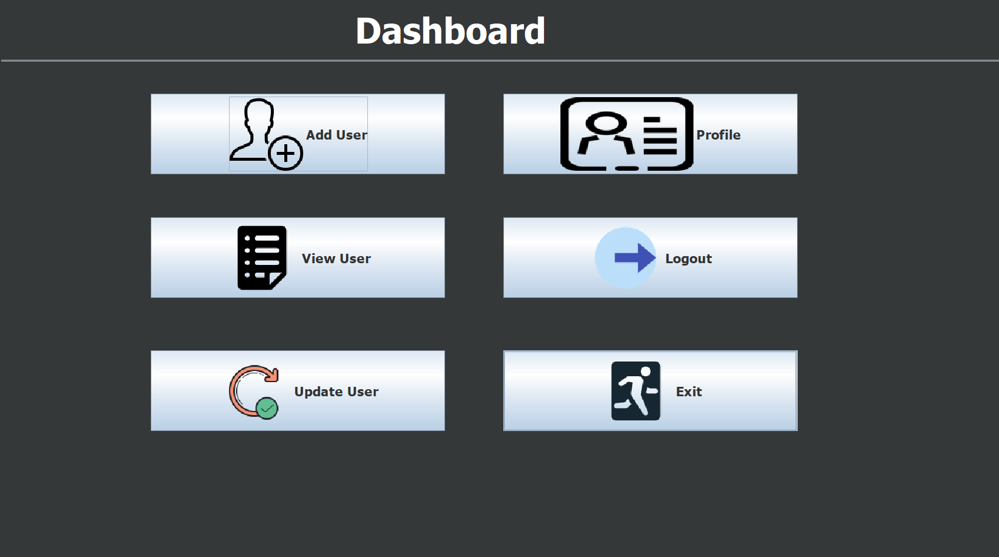
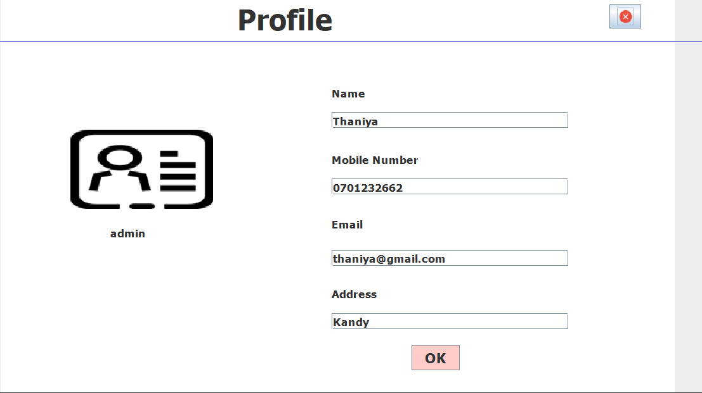

# Pharmacy Management System

## About the Project

The Pharmacy Management System is a Java-based desktop application developed to manage the main activities of a pharmacy. The system helps manage medicines, customer information, sales, and other pharmacy-related tasks through a simple and user-friendly interface.

## Technologies Used

* Java
* NetBeans IDE
* MySQL
* MySQL Connector/J

## Main Features

* User Login
* Medicine Management
* Add, Update, Delete and Search Medicines
* Customer Management
* Sales Management
* Medicine Stock Management
* Database Connectivity
* User-friendly interface

## Project Purpose

The main purpose of this project is to provide a simple computerized solution for managing pharmacy operations and to reduce manual work.

## Screenshots

### Login Page

### Dashboard

### Add Medicine

### Add User

### View User

### Profile

## How to Run

1. Download or clone this repository.
2. Open the project using NetBeans IDE.
3. Make sure Java and MySQL are installed.
4. Configure the MySQL database connection in the project.
5. Add MySQL Connector/J to the project if required.
6. Run the project from NetBeans.

## Developer

**Thaniya Thennakoon**

HND in Information Technology Undergraduate
